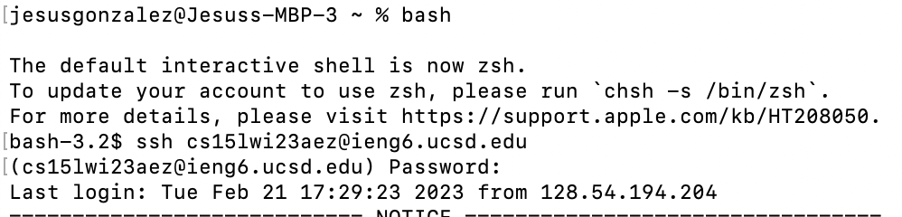

# Lab Report 4
Jesus Gonzalez - CSE 15L - A17425808 - Feb 27, 2023

---

## The task
#### Step 1
Setup Delete any existing forks of the repository you have on your account

To complete the first step I went into my github account into the lab7 repository. I then went to settings and deleted the repository, using my github password to confirm the delete.
#### Step 2
Setup Fork the repository

I forked the repository. i then confirmed the fork, and now have the lab7 repository in my github account
#### Step 3
The real deal Start the timer! - during the lab I got to a time of 1:20.
#### Step 4
Log into ieng6

I first opened terminal. I then entered bash in the terminal. Once inside of bash I logged into ieng6 by tyoing `ssh cs15lwi23aez@ieng6.ucsd.edu`.

