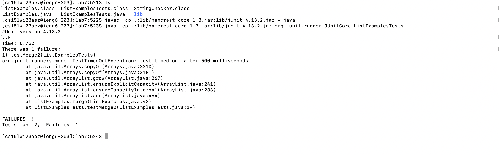
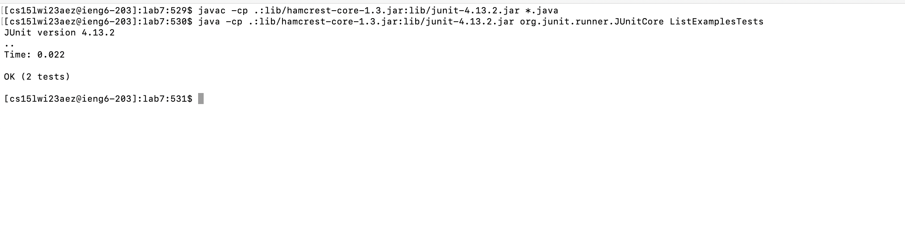

# Lab Report 4
Jesus Gonzalez - CSE 15L - A17425808 - Feb 27, 2023

---

## The task
## Step 1
Setup Delete any existing forks of the repository you have on your account

To complete the first step I went into my github account into the lab7 repository. I then went to settings and deleted the repository, using my github password to confirm the delete.
## Step 2
Setup Fork the repository

I forked the repository. i then confirmed the fork, and now have the lab7 repository in my github account
## Step 3
The real deal Start the timer! - during the lab I got to a time of 1:20.
## Step 4
Log into ieng6

I first opened terminal. I then entered bash in the terminal. Once inside of bash I logged into ieng6 by tyoing `ssh cs15lwi23aez@ieng6.ucsd.edu`.
## Step 5
Clone your fork of the repository from your Github account

I first copied the ssh link of the lab7 repository. I then used the command `git clone git@github.com:jag039/lab7.git` to clone the repository into my ieng6 account.
## Step 6
Run the tests, demonstrating that they fail

First I changed into the lab7 directory. Then I compiled all files in the directory. Then I ran the Junit Tests. In order to change the directories I just used `cd lab7`. Then I compiled by copying and pasting this command `javac -cp .:lib/hamcrest-core-1.3.jar:lib/junit-4.13.2.jar *.java`. And i ran the junit test using `java -cp .:lib/hamcrest-core-1.3.jar:lib/junit-4.13.2.jar org.junit.runner.JUnitCore ListExamplesTests`.
## Step 7
Edit the code file to fix the failing test

I typed nano List, then <tab> in order to auto complete ListExamples. I then added ".java" to the end to open the "ListExamples.java" file in nano.

I fixed the error by using the arrow keys to get to the line where the error occured. I fixed the error. I then used ^o to save the file, and ^x to exit nano.
 
## Step 8
Run the tests, demonstrating that they now succeed

I recompiled all files and re-ran the junit tests. I did this again by copying and pasting the commands (the same as step 6) into the terminal.
 
## Step 9
Commit and push the resulting change to your Github account

I fully typed the commands
 
`git add ListExamples.java`
 
`git commit -m "updated file"`
 
`git push`

 

